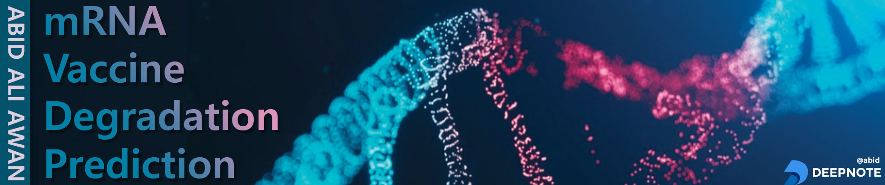

# mRNA-Vaccine-Degradation-Prediction

## Building Predictive Model
We need to design the model that will predict likely degradation rates at each base of an RNA molecule, trained on a subset of an Eterna dataset comprising over 3000 RNA molecules (which span a panoply of sequences and structures) and their degradation rates at each position.

## Improving Stability of mRNA
Improving the stability of mRNA vaccines was a problem that was being explored before the pandemic but was expected to take many years to solve.Now, we must solve this deep scientific challenge in months, if not weeks, to accelerate mRNA vaccine research and deliver a refrigerator-stable vaccine against SARS-CoV-2, the virus behind COVID-19.